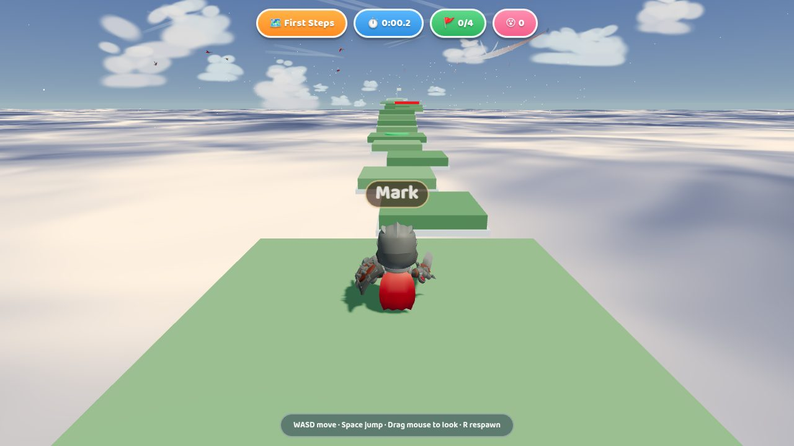
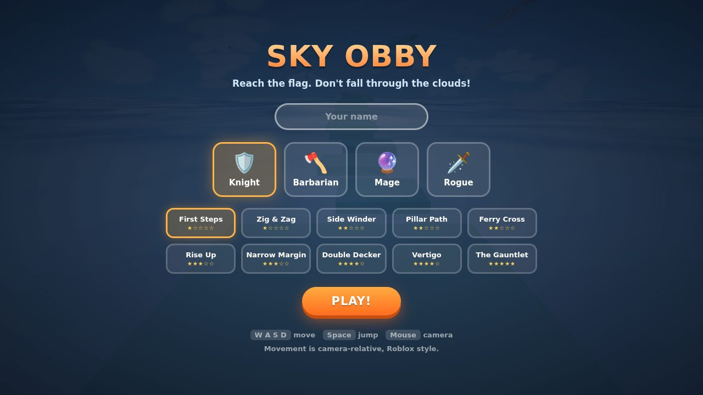
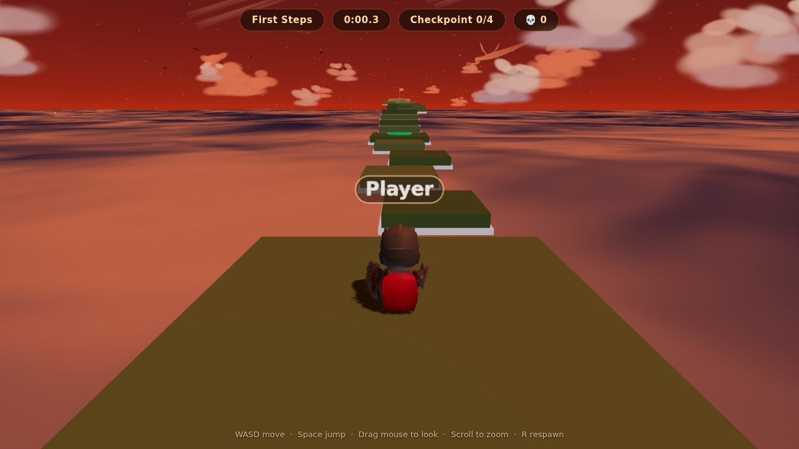
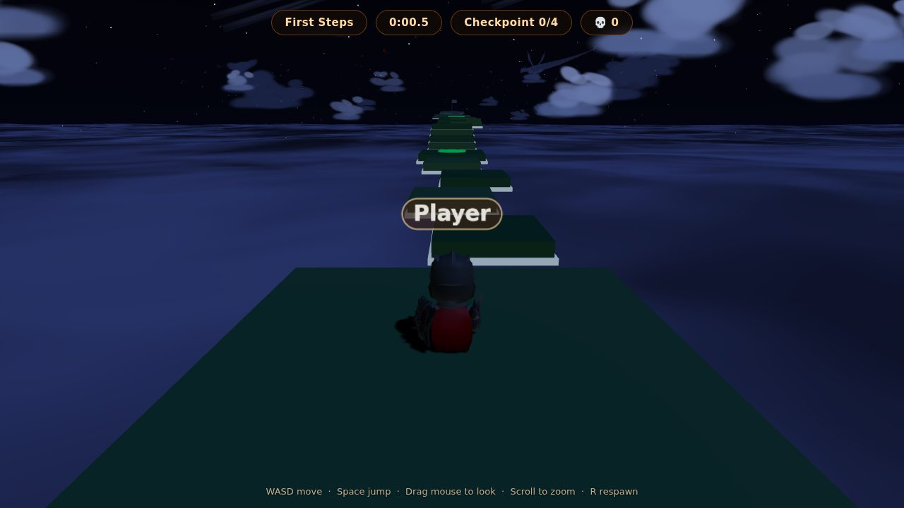
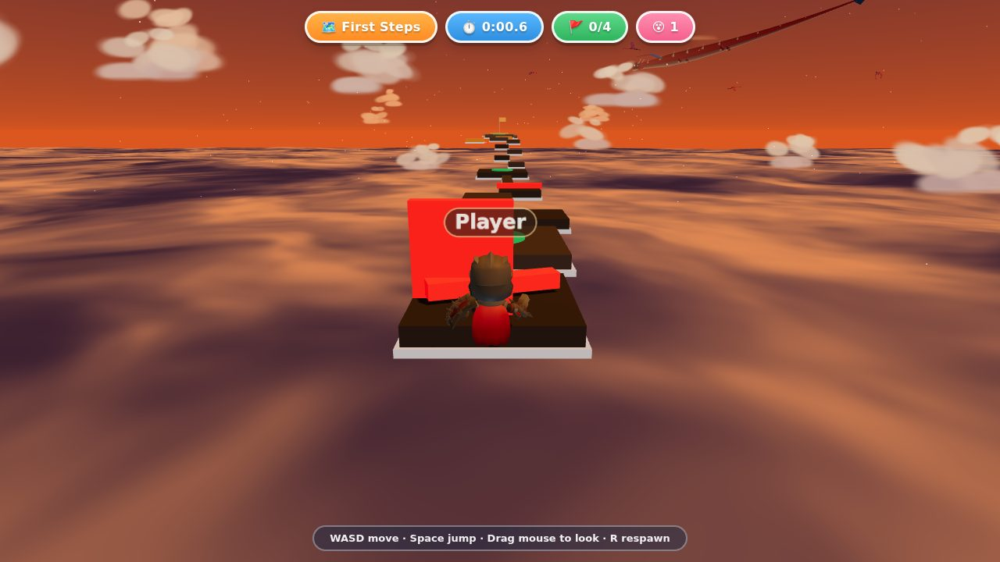
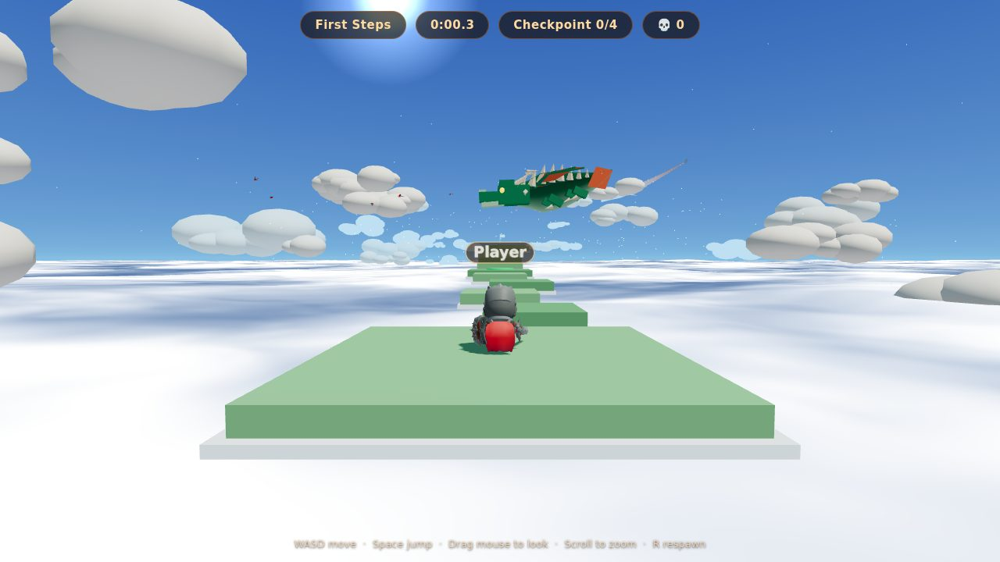
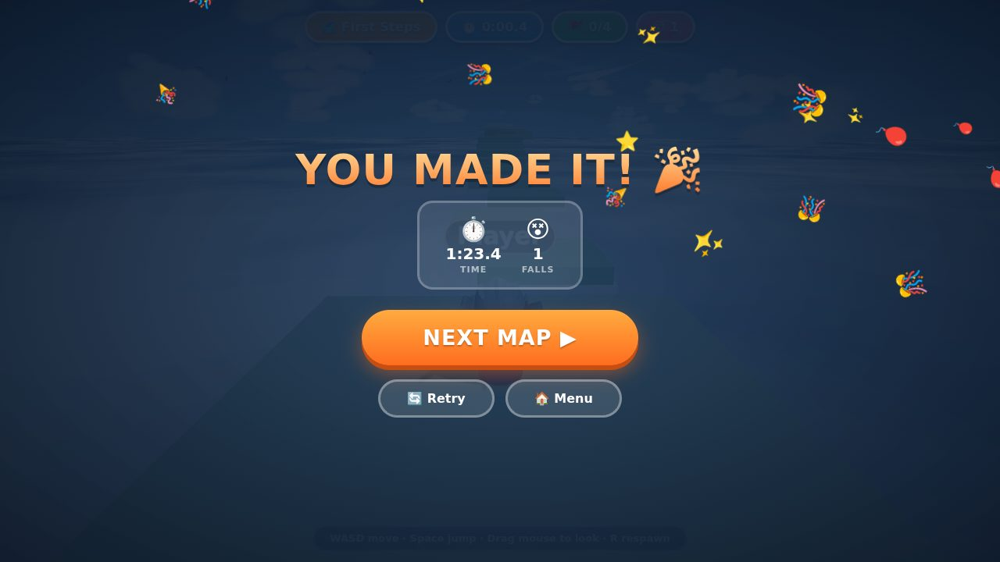

# ☁️ Stratohop

*A Roblox-style parkour ("obby") game in the sky — run, jump and ride moving
platforms between the clouds, dodge the red bars, reach the flag.*




Built with vanilla Three.js — no bundler, no framework, no runtime CDN
dependencies. Multiplayer runs on [Vask](https://vask.dev) (Pusher-protocol
compatible).

## Play it

Any static file server works (ES modules + binary assets rule out `file://`):

```bash
npx serve .          # or: python3 -m http.server 8000  /  php -S localhost:8000
```

Then open the printed URL, type your name, pick a hero and a map, and go.

| | | |
|---|---|---|
|  |  |  |
|  |  |  |

## Features

- **10 hand-tuned maps** (★ to ★★★★★), 130–190 units long with 4–5 checkpoints
  each — moving platforms, ferries, elevators, narrow beams, stepping pillars
- **Red killbricks**: low bars to jump, walls to dodge around, spinning sweepers
- **Tight platformer feel**: coyote time, jump buffering, variable jump height,
  apex float, squash & stretch — all tunables at the top of `src/Player.js`
- **A living sky**: full day/night cycle (3 min), volumetric-style clouds,
  sun, moon and stars, flocks of animated birds, and two patrolling dragons
- **4 playable heroes** (KayKit's Knight, Barbarian, Mage, Rogue) with full
  skeletal animation, plus floating player name tags
- **Provably beatable maps**: a physics simulation validates every jump on
  every map (`npm run validate`)

## Controls

**WASD / arrows** move (camera-relative) · **Space** jump — tap for a short
hop, hold for full height · **mouse drag** orbit camera · **scroll** zoom ·
**R** respawn at the last checkpoint.

## Project layout

```
index.html          UI shell, menus, import map (no build step)
src/main.js         boot, game loop, round state
src/World.js        sky dome, day/night cycle, sun/moon/stars, cloud deck & clouds
src/Level.js        map construction, moving platforms, checkpoints, killbricks
src/Player.js       character controller (custom AABB physics), animations
src/Critters.js     bird flocks (animated GLBs) + procedural dragons
src/CameraRig.js    third-person orbit camera
src/Input.js        keyboard/mouse
src/UI.js           HUD, toasts, win screen
src/NameTag.js      floating name sprites
src/Net.js          multiplayer: rooms, state broadcast (Vask/Pusher protocol)
src/Ghosts.js       remote players: interpolated models + name tags
functions/          Cloudflare Pages Function: presence-auth signer
src/maps/           MapBuilder DSL + 10 map definitions
tools/              map reachability validator (Node)
vendor/             three.js r169 (vendored, no CDN)
assets/             characters, birds, font
```

## Map validator

Every consecutive platform pair on every map is checked against a simulation
of the actual jump physics (moving platforms evaluated over a shared clock):

```bash
npm run validate
```

Run it after changing any map or any physics constant.

## Multiplayer

Rooms run over Vask presence channels with client-authoritative ghosts —
each player simulates only themselves and broadcasts position + animation at
10 Hz; remote players render interpolated with name tags. The host (lowest
member id) picks the map for the room, and finishes are announced to everyone.

Setup:

1. Put the Vask **App Key** in `.env` (`VASK_KEY=...`, see `.env.example`) —
   this is the public key, safe in any client.
2. The presence-auth signer is a Cloudflare Pages Function
   (`functions/api/vask/auth.js`). Give it the key + **secret**:
   - local: copy `.dev.vars.example` → `.dev.vars`, then run
     `npx wrangler pages dev .` (plain static servers can't run the
     auth function, so multiplayer needs wrangler locally)
   - production: `npx wrangler pages secret put VASK_KEY` and
     `... put VASK_SECRET`
3. In the menu, type a room code (or hit 🎲) and share it with friends.

### Test multiplayer locally — no Vask account, no deploy

The repo ships a tiny Pusher-protocol mock server for development:

```bash
npm install        # one-time (dev dep: ws)
npm run dev        # game + auth signer on :8788, mock realtime on :6001
```

With `.env` and `.dev.vars` pointing at the mock (see the commented block in
`.env.example` / `.dev.vars.example`), open http://localhost:8788 in two
windows, join the same room code, and play together. Switching to real Vask
later is just editing `.env` — same client code, same protocol.

## Deploy (Cloudflare Pages)

The game is a fully static site. Either connect the repo in the Cloudflare
dashboard (**no build command**, output directory **`/`**), or deploy from
the CLI:

```bash
npx wrangler pages deploy      # uses wrangler.toml
```

## Optional: premium dragon model

The dragons are procedural (continuous-skin tube bodies, built in code). To
swap in an artist-made rigged dragon, download Quaternius'
[Dragon Evolved](https://poly.pizza/m/LlwD0QNUPj) (CC0, animated) and save it
as `assets/dragons/Dragon.glb` — it's auto-detected on the next load. Delete
the file to go back to procedural.

## Credits

- Character models — [KayKit Adventurers pack](https://kaylousberg.itch.io/kaykit-adventurers) by Kay Lousberg (CC0)
- Bird models (Parrot, Flamingo, Stork) — [three.js examples](https://github.com/mrdoob/three.js/tree/dev/examples/models/gltf), originally by mirada for *3 Dreams of Black*
- Font — [Baloo 2](https://fonts.google.com/specimen/Baloo+2) by Ek Type (SIL OFL, see `assets/fonts/OFL.txt`)
- Engine — [three.js](https://threejs.org) (MIT, vendored in `vendor/`)
- Realtime — [pusher-js](https://github.com/pusher/pusher-js) (MIT, vendored) over [Vask](https://vask.dev)

Game code is [MIT licensed](LICENSE).
