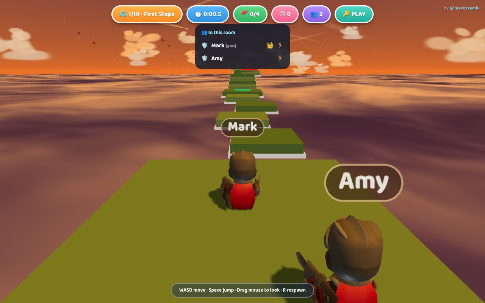

# ☁️ Stratohop

*A Roblox-style multiplayer parkour ("obby") game in the sky — run, jump and
ride moving platforms between the clouds, dodge the red bars, race your
friends to the flag. Public rooms, shareable invite links, leaderboards.*


Built with vanilla Three.js — no bundler, no framework, no runtime CDN
dependencies. Multiplayer runs on [Vask](https://vask.dev) (Pusher-protocol
compatible).

## Play it

```bash
npm run dev          # full experience incl. multiplayer — local mock Vask, no account needed
npm start            # dev server against real Vask (needs .env + .dev.vars, see below)
npm run static       # bare static server — solo play only (no auth endpoint → no rooms)
```

Then open http://localhost:8788, type your name, pick a hero and a map, and
go. Type a room code (or hit 🎲) before playing to open a multiplayer room.

| | | |
|---|---|---|
|  |  |  |
|  |  |  |

## Features

- **10 hand-tuned maps** (★ to ★★★★★), 130–190 units long with 4–5 checkpoints
  each — moving platforms, ferries, elevators, narrow beams, stepping pillars
- **Red killbricks**: low bars to jump, walls to dodge around, spinning sweepers
- **Tight platformer feel**: coyote time, jump buffering, variable jump height,
  apex float, squash & stretch — all tunables at the top of `src/Player.js`
- **A living sky**: full day/night cycle (3 min), volumetric-style clouds,
  sun, moon and stars, flocks of animated birds, and two patrolling dragons
- **4 playable heroes** (KayKit's Knight, Barbarian, Mage, Rogue) with full
  skeletal animation, plus floating player name tags
- **Provably beatable maps**: a physics simulation validates every jump on
  every map (`npm run validate`)
- **Multiplayer rooms** over [Vask](https://vask.dev) presence channels:
  public rooms appear in a live **Open rooms** list on the start screen,
  🔒 private rooms stay joinable by code or invite link (`?room=CODE`, one
  tap on the HUD 🔑 pill copies it)
- **Race together, move together**: everyone sees each other as smooth
  interpolated ghosts with name tags, a tap-to-open 👥 roster shows who's
  in and who's finished, and NEXT MAP unlocks only when the whole room is
  done — then the room advances as one
- **Leaderboards**: per-round finish order with medals on the win screen,
  plus an optional global top-10 per map (Workers KV — see below)
- **Touch controls**: floating analog joystick, camera drag, jump/respawn
  buttons — plays great on iPads and phones

## Controls

**WASD / arrows** move (camera-relative) · **Space** jump — tap for a short
hop, hold for full height · **mouse drag** orbit camera · **scroll** zoom ·
**R** respawn at the last checkpoint.

**Touch** (iPad/phone): left side of the screen is a floating joystick
(analog — tilt further to run), right side drags the camera, big ⬆️ button
jumps (hold for full height), ↻ respawns.

## Project layout

```
index.html          UI shell, menus, import map (no build step)
src/main.js         boot, game loop, round state
src/World.js        sky dome, day/night cycle, sun/moon/stars, cloud deck & clouds
src/Level.js        map construction, moving platforms, checkpoints, killbricks
src/Player.js       character controller (custom AABB physics), animations
src/Critters.js     bird flocks (animated GLBs) + procedural dragons
src/CameraRig.js    third-person orbit camera
src/Input.js        keyboard/mouse + touch (joystick, camera drag, buttons)
src/UI.js           HUD, toasts, win screen, roster, leaderboard panels
src/NameTag.js      floating name sprites
src/Net.js          multiplayer: rooms, lobby adverts, finish tally (Vask/Pusher protocol)
src/Ghosts.js       remote players: interpolated models + name tags
src/Scores.js       global leaderboard client (silent when unavailable)
functions/          Pages Functions: presence-auth signer + leaderboard API
src/maps/           MapBuilder DSL + 10 map definitions
tools/              dev server (+mock Vask), map validator, headless tests
vendor/             three.js r169 (vendored, no CDN)
assets/             characters, birds, font
```

## Map validator

Every consecutive platform pair on every map is checked against a simulation
of the actual jump physics (moving platforms evaluated over a shared clock):

```bash
npm run validate
```

Run it after changing any map or any physics constant.

## Multiplayer

Rooms run over Vask presence channels with client-authoritative ghosts —
each player simulates only themselves and broadcasts position + animation at
10 Hz; remote players render interpolated with name tags. The host (lowest
member id) picks the map for the room, and finishes are announced to everyone.

Setup:

1. Put the Vask **App Key** in `.env` (`VASK_KEY=...`, see `.env.example`) —
   this is the public key, safe in any client.
2. The presence-auth signer is a Cloudflare Pages Function
   (`functions/stratohop/api/vask/auth.js`). Give it the key + **secret**:
   - local: copy `.dev.vars.example` → `.dev.vars`, then run `npm start`
     (plain static servers can't run the auth function, so multiplayer
     needs the dev server — or `npm run dev` for the no-account mock)
   - production: `npx wrangler pages secret put VASK_KEY` and
     `... put VASK_SECRET`
3. In the menu, type a room code (or hit 🎲) and share it with friends.

Rooms are **public by default**: while you play, the host advertises the room
(code, player count, current map) to a `presence-lobby` channel, and everyone
on the start screen sees a live **Open rooms** list they can tap to join.
Tick **🔒 Private** before playing to stay unlisted — private rooms are still
joinable by code or link, just never advertised. Every room also has a
**shareable link** (`?room=CODE`): tap the 🔑 pill in the HUD to copy it, and
opening it lands a friend on the menu with the room pre-filled.

## Leaderboards

Two layers, both automatic:

- **Round results** — the win screen shows the room's finish order with
  medals. Pure client-side over Vask; works everywhere, no setup.
- **Global best times** (optional) — top 10 per map, stored in Workers KV
  via `functions/stratohop/api/scores.js`, shown on the start screen for the selected
  map. Entirely opt-in: without the KV binding the endpoint answers 503 and
  the game hides the panel. To enable it (KV's free tier is plenty):
  `npx wrangler kv namespace create SCORES`, paste the id into the
  commented `[[kv_namespaces]]` block in `wrangler.toml`, redeploy.
  One entry per name per map (a player's best); times are client-reported,
  so treat it as a fun board, not an anti-cheat one.

### Test multiplayer locally — no Vask account, no deploy

The repo ships a tiny Pusher-protocol mock server for development:

```bash
npm install        # one-time (dev dep: ws)
npm run dev        # game + auth signer on :8788, mock realtime on :6001
```

With `.env` and `.dev.vars` pointing at the mock (see the commented block in
`.env.example` / `.dev.vars.example`), open http://localhost:8788 in two
windows, join the same room code, and play together. Switching to real Vask
later is just editing `.env` — same client code, same protocol.

## Deploy (Cloudflare Pages)

Deploys go through an **allowlisted `dist/`** (built by
`tools/build-dist.mjs`) so private files can never end up on the CDN —
wrangler ignores `.gitignore`, so never deploy the repo root directly.

```bash
npm run deploy                 # builds dist/ then wrangler pages deploy
npx wrangler pages secret put VASK_KEY     # once per project
npx wrangler pages secret put VASK_SECRET
```

Or connect the repo in the Cloudflare dashboard with build command
`node tools/build-dist.mjs` and output directory **`dist`**. The
leaderboard KV binding is optional — see the comment in `wrangler.toml`.

### cloudarcade.app/stratohop — a real subfolder

The build nests the game in an actual folder — `dist/stratohop/` — and the
Pages Functions live at `functions/stratohop/api/*` to match. Bind
`cloudarcade.app` directly to this Pages project (dashboard → the project →
Custom domains) and [cloudarcade.app/stratohop/](https://cloudarcade.app/stratohop/)
just works: no proxy, no Worker. The domain root serves the arcade
landing page (`arcade/index.html` → `dist/index.html`).

The game is fully path-agnostic (every client URL is relative), so it also
still works at the deployment root. The dev server mirrors the mount:
http://localhost:8788/stratohop/ (and `/` redirects there, like production).

When a real arcade landing page takes over the cloudarcade.app root, either
build it into this project's `dist/` root, or split it into its own project
and switch to the proxy Worker kept in `tools/path-proxy-worker.js` —
that's the tool for one hostname fronting several independent projects.

## Optional: premium dragon model

The dragons are procedural (continuous-skin tube bodies, built in code). To
swap in an artist-made rigged dragon, download Quaternius'
[Dragon Evolved](https://poly.pizza/m/LlwD0QNUPj) (CC0, animated) and save it
as `assets/dragons/Dragon.glb` — it's auto-detected on the next load. Delete
the file to go back to procedural.

## Credits

- Character models — [KayKit Adventurers pack](https://kaylousberg.itch.io/kaykit-adventurers) by Kay Lousberg (CC0)
- Bird models (Parrot, Flamingo, Stork) — [three.js examples](https://github.com/mrdoob/three.js/tree/dev/examples/models/gltf), originally by mirada for *3 Dreams of Black*
- Font — [Baloo 2](https://fonts.google.com/specimen/Baloo+2) by Ek Type (SIL OFL, see `assets/fonts/OFL.txt`)
- Engine — [three.js](https://threejs.org) (MIT, vendored in `vendor/`)
- Realtime — [pusher-js](https://github.com/pusher/pusher-js) (MIT, vendored) over [Vask](https://vask.dev)

Game code is [MIT licensed](LICENSE).
